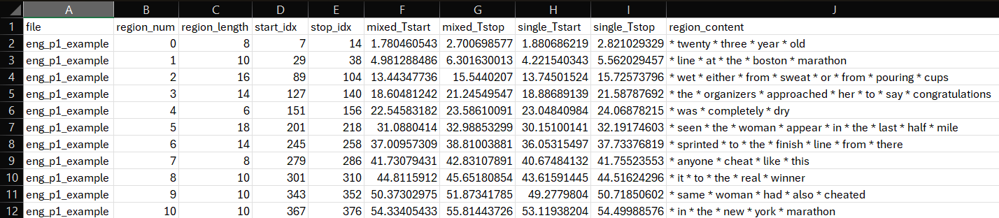

# MOSAIC
## A Language Mixing Toolbox


---
### Description

This project contains two modular scripts that support flexible processing of audio files containing multilingual speech. The primary script, MatchedSpeechRegions, offers a pipeline that can be used as a whole or in individual stages, depending on the user’s needs. It includes:

+ CTC forced alignment using a pre-trained Wav2Vec2 model (MMS_FA via torchaudio) for aligning transcripts to speech,

+ Optional batch pairing of mixed- and single-language audio files for comparison,

+ Identification of the longest error-free aligned regions within each file,

+ Extraction of the longest overlapping segments between file pairs for controlled acoustic comparison,

+ And export of cleaned, analysis-ready CSV files containing segment metadata.

Users may apply the full pipeline or selectively use only the alignment, region extraction, or overlap computation tools depending on the goals of their analysis.

### Environment Summary

- Python 3.11
- Tested on Windows and macOS
- Conda recommended for macOS users
- Platform-specific dependency handling (see Sample Usage & Example Output)

### Installation

#### Requirements

To run the MOSAIC pipeline, you’ll need Python 3.11. The system relies on the following core libraries:

* `torch` and `torchaudio` (for forced alignment)
* `matplotlib` and `numpy` (for data processing)
* `pyobjc` (macOS) or `pywin32` (Windows) for OS-specific interactions

> **Note:** This code was developed on Windows. For detailed setup instructions, including environment creation and macOS-specific MKL requirements, please skip to [Step 1: Prepare your environment](#step-1-prepare-your-environment).

> **Recommendation:** Due to its dependencies and build structure, we strongly recommend installing this project into a virtual environment (e.g., using [Anaconda](https://docs.anaconda.com/free/anaconda/install/)).

#### Jupyter Notebook Support

The primary script is implemented in a [Jupyter notebook](https://jupyter.org/install), in order to:

* Allow **step-by-step execution** of each function.
* Support **modular debugging and development**.
* Help facilitate **transparent troubleshooting** and **result interpretation**.

---

### Sample Usage & Example Output

Below is an example of how to run the full processing pipeline on a set of matched bilingual recordings from mixed- and single-language contexts. The pipeline performs forced alignment, filters alignment and/or production errors, identifies the longest overlapping region per [inter-switch interval (ISI)](#ISI), and exports both clipped audio segments and associated metadata.

The processing pipeline operates **one paragraph at a time**. For each paragraph, you must specify the
corresponding transcript files (please see Step 2) and assign a `paragraph_keyword` (please see Step 3) that uniquely identifies that paragraph in the transcript indices. This procedure should be repeated separately for each paragraph you wish to process
(e.g., Pgph1, Pgph2, etc.).

#### Step 1: Prepare your environment

0. **Create and Activate your Conda environment.** This step **must** be completed before installing any dependencies. Activating the environment ensures that all required packages are installed into a dedicated "container" for this project, rather than globally on your computer.

    + **Windows and macOS (Conda):**
    
      ```bash
      # Create the environment with Python 3.11
      conda create --name mosaic python=3.11
    
      # Activate the environment
      conda activate mosaic
      ```
    
      > **Note:** After running the activation command, look at your terminal command prompt. You should see `(mosaic)` appear in parentheses at the start of the line. If you do not see `(mosaic)`, the virtual environment is not active and any packages you install will not be accessible to the MOSAIC pipeline.
      <br><br>
    + **Additional Step for macOS Users:**
    If you are on macOS, you must also install the MKL dependency within your active environment:    <br>

      ```bash
      conda install https://api.anaconda.org/download/conda-forge/mkl/2023.2.0/osx-64/mkl-2023.2.0-h694c41f_50502.conda
      ```
0. Clone the repository: 
    ```
    git clone https://github.com/JaeDibbs/MOSAIC.git
    cd MOSAIC
    ```
1. Install dependencies:

    ```bash
    # Optional: Verify you are in the correct environment
    which python  # macOS/Linux
    where python  # Windows
    ``` 

    Choose the requirements file that matches your operating system. For GPU support or specific CUDA     versions, please consult the official [PyTorch installation guide](https://pytorch.org/get-started/locally/) and the [torchaudio documentation](https://docs.pytorch.org/audio/main/tutorials/forced_alignment_for_multilingual_data_tutorial.html).

    + Windows: 
    ```
    python -m pip install -r requirements_windows.txt
    ```

    + macOS: 
    ```bash
    python -m pip install -r requirements_mac.txt
    ```

4. Prepare your data:
	+ Organize audio files (.wav) and ensure that they follow the filenaming conventions delineated [below](#FNC).
	+ Save transcripts or target texts as `.txt` files.

#### Step 2: Define Input Paths and Transcripts

The example below sets up the paths for your audio and transcripts. While the code allows you to define multiple target texts (e.g., P1 and P2), you only need one target text, provided it is available in both contexts (e.g., mixed-language and single-language).

```python
# Specify the paths to the audio files
single_dir = r"C:\Path\To\Single\Language\Context\Audio"
mixed_dir = r"C:\Path\To\Mixed\Language\Context\Audio"

# Specify the paths to the transcript files
P1_mixed_transcriptdir = r"C:\Path\To\Mixed\Language\Context1\Transcript\MixedTranscriptName.txt"
P1_single_transcriptdir = r"C:\Path\To\Single\Language\Context1\Transcript\SingleTranscriptName.txt"
P2_mixed_transcriptdir = r"C:\Path\To\Mixed\Language\Context2\Transcript\MixedTranscriptName.txt"
P2_single_transcriptdir = r"C:\Path\To\Single\Language\Context2\Transcript\SingleTranscriptName.txt"

# Specify the output directories
audio_output_path = r"C:\Where\You\Want\The\Extracted_Audio\To\Go"
output_csv_dir = r"C:\Where\You\Want\The\Alignments\to\Go"
output_regions_dir = r"C:\Where\You\Want\The\Regions\To\Go"
```

> *Note on inputs*:
> * **Contexts:** You must provide a transcript for each of the conditions to be compared (e.g., mixed- and single-language) for every transcript/target text you wish to process.
> * **File Storage:** The audio files for these conditions **do not** need to be stored in separate folders. A helper function (`parse_filename`) automatically sorts them based on your filenames during batch processing.
> * **Naming Convention:** It is essential that your input audio files follow the naming conventions detailed [below](#FNC) for the sorting to work correctly.
> * **macOS Users:** File paths in the examples use Windows-style separators `(\)`. If you’re working in macOS, replace them with `/`.

Below, we run the pipeline for the target text `Pgph1`, using the corresponding text files and ISI indices defined above.

#### Step 3: Run the pipeline

```python
starsupon = True  # insert wildcards into transcripts/target texts

# Define ISI indices
LangA_P1_indices = [(0,23), (29,63), (69,105), (111,145), (151,161), (167,233), (239,273), (279,295), (301,337), (343,361), (367,388)]
LangB_P1_indices = [(0,23), (29,65), (71,107), (113,145), (151,161), (167,231), (237,271), (277,295), (301,337), (343,363), (369,390)]
LangA_P2_indices = [(0,47), (53, 81), (87, 97), (103, 117), (123, 139), (145, 193), (199, 227), (233, 293), (299, 307), (313, 359), (365, 398)]
LangB_P2_indices = [(0,49), (55, 83), (89, 99), (105, 117), (123, 137), (143, 191), (197, 227), (233, 289), (295, 303), (309, 357), (363, 390)]

# Normalize transcripts/target texts
mixed_normalized = normalization(P1_mixed_transcriptdir)
single_normalized = normalization(P1_single_transcriptdir)

# Process paired audio files
paragraph_keyword = "Pgph1"
process_paired_audio_files(Path(single_dir), Path(mixed_dir), paragraph_keyword,
    mixed_normalized, single_normalized,
    Path(output_csv_dir), Path(audio_output_path), Path(output_regions_dir))
```
> *Please note*: By default, the script inserts wildcards (*) between words in the user-specified transcripts/texts. The addition of wildcards can improve alignment when there is significant background noise, use of back channels and/or fillers, and/or deviations from the text used for alignment (e.g., lots of restarts or errors when reading a passage). 

> If you want to use this script *only* for multilingual forced alignment of audio data, you can toggle this function off by setting the `starsupon` boolean to `False`. If running the region building module or full pipeline, however, it is necessary to leave this parameter set to `True`.

Here, **`paragraph_keyword`** is a string label (e.g., `"Pgph1"`, `"Pgph2"`) used to sort audio files within a directory during processing. This label allows audio files corresponding to multiple target paragraphs to be stored in a single directory. During processing, files are grouped by `paragraph_keyword` and routed to the appropriate transcript files and inter-switch interval (ISI) indices. The keyword must match the paragraph identifiers used in the ISI indices and is passed to the processing function **`process_paired_audio_files`**.

To process multiple paragraphs stored in the same folder, repeat Step 3 for each paragraph, updating the `paragraph_keyword` accordingly. If the audio files are stored in different folders, update the file paths (Step 2) and the `paragraph_keyword` (Step 3) accordingly. 

#### After running this command:

* `.csv` files containing alignment spans and matched region metadata will be saved in `output_csv_dir` and `output_regions_dir`.
* Audio clips of the longest overlapping speech regions will be saved in `audio_output_path`.

#### Quick Test
To verify your installation, you can run the pipeline using the provided sample data:
1. Ensure the `mosaic` virtual environment is active. 
2. Open Jupyter notebooks within this virtual environment.
3. Open `MOSAIC.ipynb`.
4. Run the cells using the default paths pointing to the `/samples` folder.

#### Example Output

Example of region data that can be output to CSV:



#### Special Case: Compare Two Files (no batch processing)

If you do not want to batch process files (i.e., specify only two files to compare), this functionality is enabled by the `process_audio_file` function.  To run the full pipeline on two files only, update the following block with the paths to the two audio files you wish to compare:  
```  
#Define input audio and transcript paths if processing files individually  

#Specify the two audio files

wav_file_mixed = r"C:\Path\To\Audio_Mixed.wav"
wav_file_single = r"C:\Path\To\Audio_Single.wav"

#And the two transcript files
mixed_transcriptdir = r"C:\Path\To\TargetTxt_Mixed.txt"
single_transcriptdir = r"C:\Path\To\TargetTxt_Single.txt"
```
And then update and run the following block:

```
#Process two paired audio files (forced align, build regions, compare regions)

#Boolean that sets whether to intercalate wildcards in target text
starsupon = True 

#Define ISI indices
LangA_P1_indices = [(0,23), (29,63), (69, 105), (111, 145), (151,161), (167, 233), (239, 273), (279, 295), (301, 337), (343, 361), (367, 388)]
LangB_P1_indices = [(0,23), (29,65), (71, 107), (113, 145), (151,161), (167, 231), (237, 271), (277, 295), (301, 337), (343, 363), (369, 390)]

#Normalize the transcript text
mixed_normalized = normalization(mixed_transcriptdir)
single_normalized = normalization(single_transcriptdir)
mixed_waveform, mixed_samplerate, mixed_regions, mixed_transcript, mixed_spans, mixed_name, mixed_frames = process_audio_file(wav_file_mixed, mixed_normalized, LangA_P1_indices)
single_waveform, single_samplerate, single_regions, single_transcript, single_spans, single_name, single_frames = process_audio_file(wav_file_single, single_normalized, LangA_P1_indices)
```
---

### <a id="FNC"></a> File Structure and Naming Conventions

#### Key Terms
*  *Default* vs. *Only*: As used here, *Default* conditions include code-switches, while *Only* conditions contain speech in a single language (i.e., no code-switching).
*  <a id="ISI"></a>*Inter-switch Interval (ISI)*: The span between two code switches, represented in the script as a list of tuples marking the start and end indices of each interval. If the input text or transcript is a list of words, each tuple indicates the positions within that list of the first and last word in a given ISI. 
* *Region#*: The numerical ID assigned to each inter-switch interval (e.g., 1, 2)

#### Input Transcript or Target Text Files

Forced alignment requires a transcript or target text (e.g., the paragraph(s) participants read aloud). 

The transcript must be a plain `.txt` file, but there are no restrictions on the filename. 

#### <a id="FNC"></a>Input Audio Files

Input audio files should follow this naming convention:

`[ParticipantID]_[Pgph#]_[LangCond].wav`

<br>

| Component | Description | Examples |
| :--- | :--- | :--- |
| **ParticipantID** | A participant's unique identifier (letters/digits) | `p2`, `B01R` |
| **Pgph#** | Target text label | `Pgph1`, `Pgph2` |
| **LangCond** | Condition label (e.g., language + code switch inclusion) | `LangADefault`, `LangBOnly` |

> **Note on Compatibility:** While this documentation focuses on the primary naming convention above, the code includes legacy support for an additional format used in prior research. Users should utilize the format described above for the best experience.

+ **Customizing Language Labels:**<br><br> 
  By default, the script looks for `LangA` and `LangB`. If you prefer specific abbreviations (e.g., `Eng`, `Kor`), you must update the regular expression in the `parse_filename` function:

  ```python
  # Default Setting - handles LangA/LangB:
  # Example: "B102R_Pgph1_LangAOnly"
  match = re.search(r"(?P<pgph>Pgph\d+).*_(?P<lang>LangA|LangB)(Default|Only)", name)

  # Modified Version - handles Eng/Kor:
  # Example: "B102R_Pgph1_EngOnly"
  match = re.search(r"(?P<pgph>Pgph\d+).*_(?P<lang>Eng|Kor)(Default|Only)", name)
  ```
  **Important:** After updating the regular expression, search the rest of the script for all instances of `LangA` and `LangB` and replace them with your chosen abbreviations.
  >**Tip:** Regular expressions, like the one used in (`match`), and Python variables are case-sensitive. Ensure the casing in your filenames (e.g., Eng) exactly matches what is written in the code.

---

### Publication

J. Dibbern, T. Gollan, D. Garcia, J.Quinn, and M. Goldrick. *Automated Analysis of Code-Mixed Speech: Investigating Costs of Language Mixing in Fully Connected Speech.* [Report in Preparation].   

### License

This project is licensed under the MIT License. See the `LICENSE` file for details.

### Acknowledgments

This work was supported by NSF DRL 2219843 and NIH Grant AG076415. 
